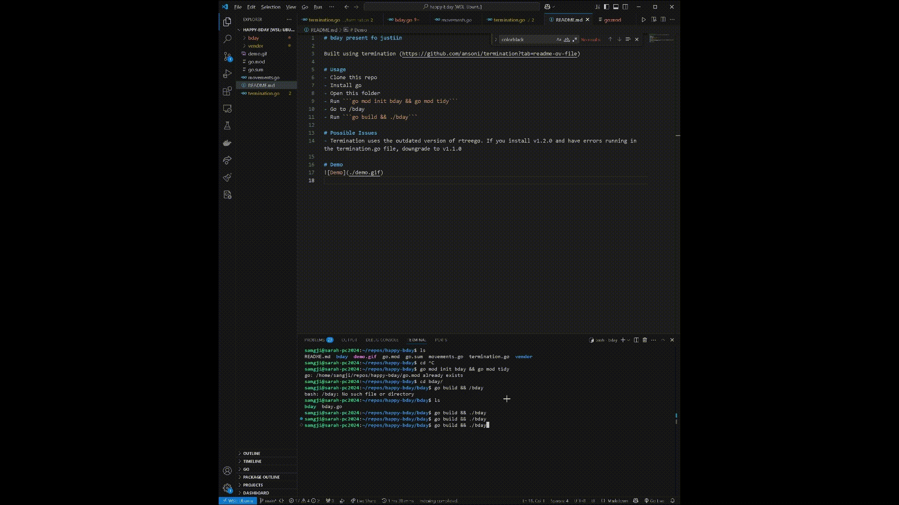

# bday present fo justiin

Built using termination (https://github.com/ansoni/termination?tab=readme-ov-file)

# Usage
- Clone this repo
- Install go
- Open this folder
- Run ```go mod init bday && go mod tidy```
- Go to /bday
- Run ```go build && ./bday```

# Possible Issues
- Termination uses the outdated version of rtreego. If you install v1.2.0 and have errors running in the termination.go file, downgrade to v1.1.0

# Demo

Downlaod demo.mp4 for a higher quality version
